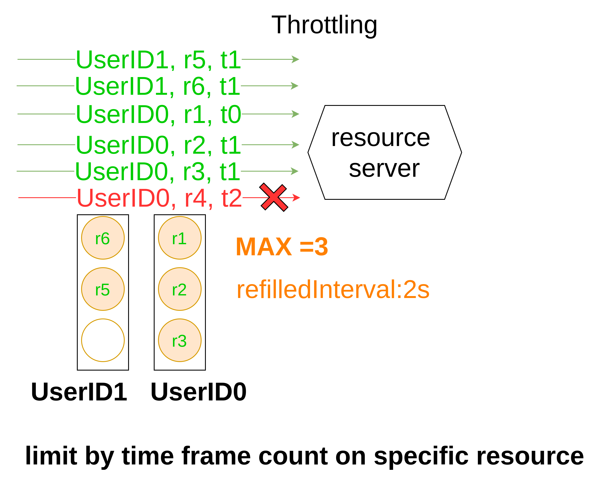
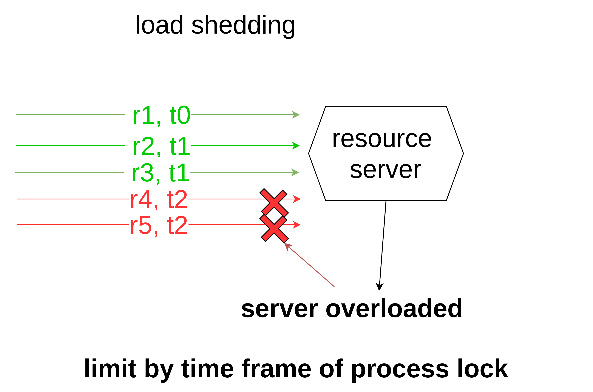
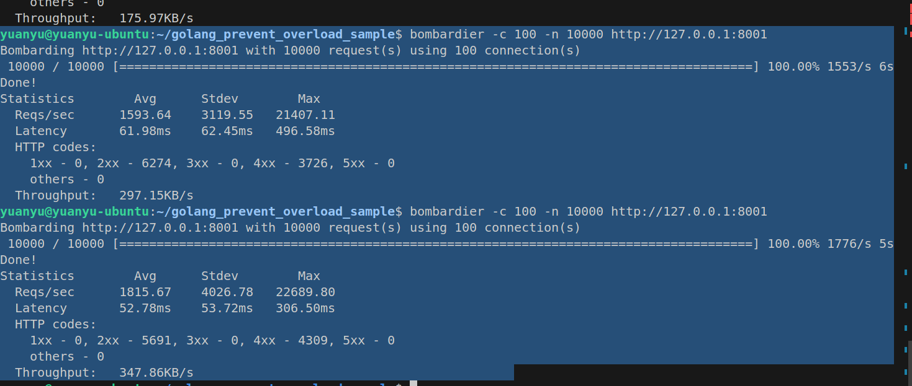
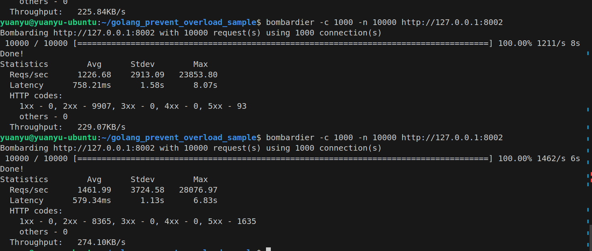

# golang_prevent_overload_sample

This repostory is demo how to use golang to implementation prevent overload mechanisms:

1. ratelimiter
2. load shedding


## rate limiter



## load shedding



## loading test tool

```shell
go install github.com/codesenberg/bombardier@latest
```
## golang implementation

### rate-limiter
token bucket
```golang
import (
	"fmt"
	"log"
	"net/http"
	"sync"
	"time"
)

type bucket struct {
	remainingTokens int
	lastRefillTime  time.Time
}

type RateLimiter struct {
	maxTokens      int
	refillInterval time.Duration
	buckets        map[string]*bucket
	mu             sync.Mutex
}

func NewRateLimiter(rate int, perInterval time.Duration) *RateLimiter {
	return &RateLimiter{
		maxTokens:      rate,
		refillInterval: perInterval,
		buckets:        make(map[string]*bucket),
	}
}

func (rl *RateLimiter) IsLimitReached(id string) bool {
	rl.mu.Lock()
	defer rl.mu.Unlock()

	b, ok := rl.buckets[id]
	// if the bucket doesn't exist, it is the first request for this client
	// Create a new bucket and allow the request
	if !ok {
		rl.buckets[id] = &bucket{
			remainingTokens: rl.maxTokens - 1,
			lastRefillTime:  time.Now(),
		}
		return false
	}
	// Calculate the number of tokens to add to the bucket since the last request
	refillInterval := int(time.Since(b.lastRefillTime) / rl.refillInterval)
	tokensAdded := rl.maxTokens * refillInterval
	currentTokens := b.remainingTokens + tokensAdded

	// There is no token to serve the request for this client, reject the client
	if currentTokens < 1 {
		return true
	}

	if currentTokens > rl.maxTokens {
		// if the number of current tokens is greater than the maximum allowed
		// then reset the bucket and decrease the number of tokens by 1
		b.lastRefillTime = time.Now()
		b.remainingTokens = rl.maxTokens - 1
	} else {
		// Otherwise, update the bucket and decrease the number of tokens by 1
		deltaTokens := currentTokens - b.remainingTokens
		deltaRefills := deltaTokens / rl.maxTokens
		deltaTime := time.Duration(deltaRefills) * rl.refillInterval
		b.lastRefillTime = b.lastRefillTime.Add(deltaTime)
		b.remainingTokens = currentTokens - 1
	}
	// Allow the request
	return false
}

type Handler struct {
	rl *RateLimiter
}

func NewHandler(rl *RateLimiter) *Handler {
	return &Handler{rl: rl}
}

func (h *Handler) GetHandler(w http.ResponseWriter, r *http.Request) {
	// simulate request clientID
	clientID := "some-client-id"
	if h.rl.IsLimitReached(clientID) {
		w.WriteHeader(http.StatusTooManyRequests)
		fmt.Fprint(w, http.StatusText(http.StatusTooManyRequests))
		return
	}
	w.WriteHeader(http.StatusOK)
	fmt.Fprint(w, http.StatusText(http.StatusOK))
}
```
### load testing

### load shedding
```golang
package main

import (
	"context"
	"fmt"
	"log"
	"net/http"
	"sync/atomic"
	"time"
)

type LoadShedder struct {
	isOverLoaded atomic.Bool
}

func NewLoadShedder(ctx context.Context, checkInterval, overloadFactor time.Duration) *LoadShedder {
	ls := LoadShedder{}

	go ls.runOverLoadDetector(ctx, checkInterval, overloadFactor)

	return &ls
}

func (ls *LoadShedder) runOverLoadDetector(ctx context.Context, checkInterval, overloadFactor time.Duration) {
	ticker := time.NewTicker(checkInterval)
	defer ticker.Stop()

	// Start with a fresh start time
	startTime := time.Now()
	for {
		select {
		case <-ctx.Done():
			return
		case <-ticker.C:
			// check how long it took to process the latest batch of requests
			elapsed := time.Since(startTime)
			if elapsed > overloadFactor {
				// if it took longer than the overload factor, we're overloaded
				ls.isOverLoaded.Store(true)
			} else {
				// Otherwise, we're not overloaded
				ls.isOverLoaded.Store(false)
			}
			// Reset the start time
			startTime = time.Now()
		}
	}
}

func (ls *LoadShedder) IsOverLoaded() bool {
	return ls.isOverLoaded.Load()
}

type Handler struct {
	ls *LoadShedder
}

func (h *Handler) GetHandler(w http.ResponseWriter, r *http.Request) {
	if h.ls.IsOverLoaded() {
		w.WriteHeader(http.StatusServiceUnavailable)
		fmt.Fprint(w, http.StatusText(http.StatusServiceUnavailable))
		return
	}
	w.WriteHeader(http.StatusOK)
	fmt.Fprint(w, http.StatusText(http.StatusOK))
}
func NewHandler(ls *LoadShedder) *Handler {
	return &Handler{ls: ls}
}
```
### load testing

